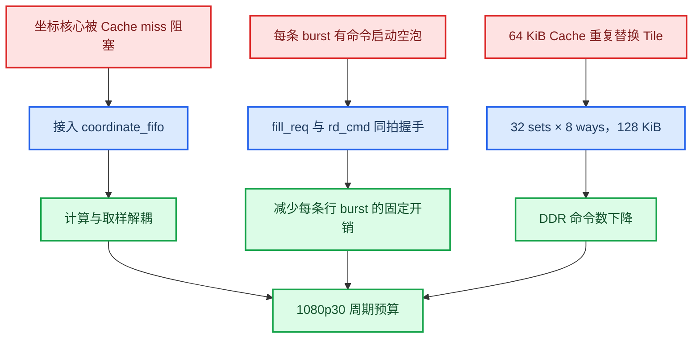

# 1080p30 吞吐率扩展原理与 RTL 改动说明

_面向 MES50HP / PGL50H 的完整畸变校正与 RGBX8888 Cache 路径；记录无相机、无板卡阶段已经完成的吞吐优化，以及进入 PDS 前需要理解的硬件边界。_

---

## 🎯 优化目标与结论

目标视频格式为 1920×1080@30 fps，算法时钟按 100 MHz 估算。单帧可用算法周期为：

```text
100,000,000 / 30 = 3,333,333 cycles/frame
```

完整畸变校正不是简单的“每拍计算一个像素”。每个输出坐标可能需要从 DDR3 读取源图像四邻域，读取路径还要承受 Cache miss、DDR 首拍延迟和命令反压。因此吞吐率的核心不是继续堆乘法器，而是让坐标计算、Cache 服务和 DDR burst 之间能够解耦，并尽量减少每条 burst 的空泡。

当前 32-set × 8-way RGBX8888 Tile Cache 配置的 1080p 完整图片回归结果如下：

| 指标 | 优化前完整畸变 + Cache | 当前结果 |
|---|---:|---:|
| 输出像素 | 2,073,600 | 2,073,600 |
| DDR 行 burst 命令 | 134,752 | 94,576 |
| DDR 数据 beat | 539,008 | 378,304 |
| 算法周期 | 38,487,557 | 3,237,697 |
| 100 MHz 预算 | 3,333,333 | 3,333,333 |
| 预算余量 | 不满足 | 95,636 cycles |

当前结果对应约 32.377 ms/frame，理论上达到约 30.89 frame/s。RGB888 输出与固定点黄金图逐像素一致。这个结论针对当前 XSim DDR 行为模型和单未完成读事务；PDS 仍需确认 DRM、LUT、FF、APM 与 100 MHz 时序，实板还需测量真实 DDR3 仲裁和 HDMI 并发。

## 🧭 原始瓶颈

### 坐标流水线与取样路径速率不匹配

`distortion_core_optimized.sv` 是固定延迟、不可回压的坐标计算流水线，可以连续产生坐标；而原始取样路径一次只处理一个坐标，并且需要等待四个邻域像素或一个 Tile 完成填充。若直接把两者相连，Cache miss 时会发生以下问题：

- 坐标计算已经产生下一项结果，但取样端仍然忙碌
- 没有中间存储就会覆盖坐标或让上游被迫停顿
- Cache miss 延迟会传播到整个坐标计算链
- 输出吞吐率由最慢的一次 DDR miss 决定，而不是由命中路径决定

### Tile miss 会被多层状态机放大

当前 Cache 的 Tile 为 32×4 像素，DDR 数据宽度为 256 bit，即每个 32 像素行需要 4 个 DDR beat。一个 Tile miss 需要填充 4 行，因此至少要完成 4 条行 burst、16 个数据 beat。

原始路径还有两个结构性开销：

1. `ddr_burst_reader.sv` 先接收填充请求，再经过独立的命令状态才发出 DDR 命令。
2. Cache 和 DDR reader 每次只允许一条行 burst，命令间存在不必要的状态切换空拍。

### Cache 容量不足造成重复读

原始配置为 16 sets × 8 ways，保存 128 个 32×4 Tile，RGBX8888 数据容量为：

```text
16 × 8 × 32 × 4 × 4 bytes = 65,536 bytes = 64 KiB
```

畸变映射后的源坐标不是简单的线性扫描，局部工作集容易超过 64 KiB，导致刚填充的 Tile 被较快替换，增加 burst 命令数。仅仅提高坐标计算频率无法解决这一类 DDR 交通量问题。

## 🔗 优化后的数据流

```mermaid
flowchart LR
    accTitle: 1080p30 Throughput Dataflow
    accDescr: The optimized path decouples the non-stallable distortion coordinate pipeline from Tile Cache misses with a coordinate FIFO, removes the DDR command-start bubble, and uses a larger set-associative RGBX Tile Cache.

    scanner[🧭 mes50hp_top scanner] --> core[⚙️ distortion_core_optimized]
    core --> fifo[(📥 coordinate_fifo<br/>544 entries, 32 reserved)]
    fifo --> fetch[🔎 cached_pixel_fetch_engine]
    fetch --> cache[(⚡ pixel_tile_cache<br/>32 sets × 8 ways)]
    cache --> reader[📦 ddr_burst_reader<br/>32×4 Tile row]
    reader --> adapter[🔌 ddr3_rgbx_cache_adapter]
    adapter --> ddr[(💾 shared DDR3 controller)]
    ddr --> adapter
    adapter --> reader
    reader --> cache
    cache --> fetch
    fetch --> interp[🧮 bilinear_interp]
    interp --> output[📤 corrected RGB888 stream]

    classDef compute fill:#dbeafe,stroke:#2563eb,stroke-width:2px,color:#1e3a5f
    classDef storage fill:#fef9c3,stroke:#ca8a04,stroke-width:2px,color:#713f12
    classDef io fill:#dcfce7,stroke:#16a34a,stroke-width:2px,color:#14532d

    class scanner,core,fetch,reader,interp compute
    class fifo,cache,ddr storage
    class adapter,output io
```



优化后的关键思想是：

- 坐标核心只负责产生坐标，不等待 DDR miss
- FIFO 保存已经计算好的坐标、插值小数和 `sof/eol`
- Cache hit 从 FIFO 连续取出并快速完成
- Cache miss 只阻塞取样服务端，不覆盖上游坐标
- DDR 每条行 burst 在接受填充请求的同一拍发出命令
- 32-set Cache 减少畸变访问造成的重复填充

## 🧱 已修改与正式接入的 RTL 模块

### 坐标 FIFO：吸收 Cache miss 延迟

文件：`../platform/common/memory/coordinate_fifo.sv`

该文件原本是通用坐标 FIFO；本次吞吐优化将它正式放入图像流水线，并增加了 `RESERVE_SLOTS` 和 `reserve_ready` 机制。

在 `distortion_image_pipeline.sv` 中使用：

```text
DEPTH        = 544
RESERVE_SLOTS = 32
有效安全容量 = 544 - 32 = 512 项坐标
```

`distortion_core_optimized.sv` 没有输出 `ready`，因此不能等 FIFO 已经完全写满后才停止。预留 32 项空间用于吸收核心内部已经接受、但尚未输出的固定流水事务，避免 FIFO 满时发生坐标丢失。

`reserve_ready` 的作用是：

- FIFO 未达到安全上限时，允许扫描器继续输入
- 到达安全上限时，等待取样端先消费一项
- FIFO 满且同拍发生出队时，允许入队和出队并行，避免额外停拍

### 图像流水线：从单项缓存改为流式 FIFO

文件：`../algorithm/distortion/distortion_image_pipeline.sv`

主要变化：

- 移除原来单项 `coordinate_in_flight` / 坐标保持槽的串行节流方式
- 将畸变核心输出写入 `coordinate_fifo`
- 将 FIFO 输出连接到 `cached_pixel_fetch_engine`
- `in_ready` 改由 FIFO 的 `reserve_ready` 驱动
- 取样端只在真正接收 FIFO 项时出队
- 保留 `sof/eol/coord_valid/dx/dy` 与坐标一起传输，防止图像边界错位

这一步不改变 Brown-Conrady 公式、定点格式或输出像素，只改变不同阶段之间的排队关系。

### DDR burst reader：消除命令启动空泡

文件：`../platform/common/memory/ddr_burst_reader.sv`

优化前的节拍是：

```text
STATE_IDLE 接收 fill_req
    ↓
STATE_CMD 等待并发出 rd_cmd
    ↓
STATE_DATA 接收 4 个 DDR beat
```

优化后，`fill_req_valid && fill_req_ready` 与 `rd_cmd_en && rd_cmd_ready` 共享同一个握手周期：

```text
fill_req + rd_cmd 同拍握手
    ↓
STATE_DATA 接收 4 个 DDR beat
```

这只在 DDR 端确认 `rd_cmd_ready` 的前提下发生，因此仍然遵守 ready/valid 协议。命令地址直接由当前填充请求计算，数据阶段仍锁存 Tile 坐标、行号和 beat 序号。

### RGBX Cache 引擎：参数化 Cache 容量

文件：`../platform/common/memory/cached_pixel_fetch_engine.sv`

新增参数：

```text
TILE_CACHE_SET_COUNT = 16（默认）
TILE_CACHE_WAYS      = 8
```

板级实例将 `TILE_CACHE_SET_COUNT` 设置为 32，因此当前板级容量为：

```text
32 × 8 × 32 × 4 × 4 bytes = 131,072 bytes = 128 KiB
```

`pixel_tile_cache.sv` 本身已经使用 `SET_COUNT`、`WAYS` 参数计算 Tag、LRU 和 Bank 地址，因此不需要改变 Tile 数据布局。容量扩展的代价主要是片上 DRM/RAM 资源和 Tag/LRU 比较逻辑，必须在 PDS 中确认实际推断结果。

### 算法顶层与板级顶层：传递并固定配置

文件：

- `../board/pgl50h/mes50hp_top.sv`
- `../board/pgl50h/pgl50h_board_top.sv`

`TILE_CACHE_SET_COUNT` 和 `TILE_CACHE_WAYS` 从算法顶层逐级传递到 RGBX Cache。PGL50H 板级实例固定为 32 sets × 8 ways，并继续通过 `ddr3_rgbx_cache_adapter.sv` 接入共享 DDR 控制器。

## 🚫 为什么没有直接加入多在途 DDR 读

当前官方读控制路径只安全支持一笔活动读事务。`../vendor/pgl50h/ddr/wr_cmd_trans.v` 中，`rd_cmd_ready` 会在一笔读命令触发后拉低，直到当前读传输完成。因此，如果上层未经验证就同时发出多条 burst：

- 后发命令可能被官方控制器丢弃
- 返回 beat 无法可靠关联到对应 Tile 行
- Cache 写入的 Tile/row/beat 标签可能错配
- 行为仿真可能通过，但真实 PGL50H 控制器出现图像破坏

因此本次方案选择“坐标 FIFO + 更大 Cache + 零命令启动空泡”，没有增加一个未经官方控制器协议验证的多在途读模块。以后若 PDS/IP 资料确认读控制器支持多个 outstanding read，再单独设计带 Tag 的 `ddr_read_request_fifo` 和返回重排表，不能直接把当前 `ddr_burst_reader` 改成并发版本。

## 📊 吞吐率改善的因果链



## 🧪 新增与更新的验证文件

本次没有新增生产用 DDR 并发模块，新增的是验证吞吐修改的 Testbench 和 Runner：

| 文件 | 验证内容 |
|---|---|
| `../../sim/tb_distortion_pipeline_fifo_decouple.sv` | Cache 停顿时 FIFO 能持续接收坐标，验证上游不被单项槽位锁死 |
| `../../sim/run_distortion_pipeline_fifo_decouple.ps1` | FIFO 解耦回归 Runner |
| `../../sim/tb_ddr_burst_reader_zero_bubble.sv` | 填充请求和 DDR 命令同拍握手、地址和长度正确 |
| `../../sim/run_ddr_burst_reader_zero_bubble.ps1` | 零空泡读启动回归 Runner |
| `../../sim/run_mes50hp_top_cache_image_1080p.ps1` | 32-set Cache 的 1080p 图片级回归 |
| `../../sim/run_pgl50h_board_top_compile.ps1` | 板级结构编译，包含坐标 FIFO 依赖 |

核心回归命令：

```powershell
.\sim\run_mes50hp_top_cache_image_1080p.ps1 -CacheSets 32
.\sim\run_distortion_pipeline_fifo_decouple.ps1
.\sim\run_ddr_burst_reader_zero_bubble.ps1
.\sim\run_pgl50h_board_top_compile.ps1
```

1080p 图片结果目录为：

```text
../../result/sim_assets/cache_full_chain_1920x1080/
```

其中应重点检查 `rtl_corrected_q18_1920x1080.png`、`golden_corrected_q18_1920x1080.png`、`cache_correction_comparison_1920x1080.png`，以及 XSim 日志中的 `TEST_PASS` 和 `PASS: RGB888 frames match (1920x1080)`。

## 🧰 进入 PDS 前后的检查顺序

### 进入 PDS 前确认

- 使用板级 `pgl50h_board_top.sv`，不是直接把 `mes50hp_top.sv` 当物理顶层
- 确认 32-set × 8-way 参数已经从板级顶层传递到 `pixel_tile_cache.sv`
- 确认 `ddr3_rgbx_cache_adapter.sv` 的 burst 长度、地址单位和共享控制器接口一致
- 保留 `coordinate_fifo` 的 32 项 reserve，不要为了填满 FIFO 而删除保护空间
- 保存 1080p 图片回归日志和输出图，作为 PDS 修改后的功能基线

### PDS 中需要重点观察

| 检查项 | 原因 |
|---|---|
| DRM/RAM 推断数量 | 128 KiB Cache 是否按预期映射到片上存储 |
| LUT/FF 数量 | 32-set Tag 比较、LRU 和地址计算的代价 |
| APM 使用量 | 畸变核心和双线性插值是否超出预算 |
| 100 MHz 静态时序 | Cache 查找、FIFO、DDR 适配器和输出写路径关键路径 |
| DDR `rd_cmd_ready` 行为 | 实际 IP 是否仍保持单未完成读语义 |
| 读写仲裁 | 输入采集、算法 Cache 读、输出帧写和显示读是否互相影响 |

若 PDS 发现 128 KiB Cache 资源过高，优先比较 16-set 与 32-set 的资源/周期折中；若时序不收敛，优先把 Cache Tag/LRU、DDR 适配器地址计算和输出写打包拆成寄存器级。不要先引入多在途 DDR，除非已经拿到官方 IP 的 outstanding 读协议证据。

## 🔗 相关工程文件

- [RTL 模块总览](./RTL模块总览.md)
- [畸变矫正图像与板载仿真流程](./畸变矫正图像与板载仿真流程.md)
- [1080p30 吞吐基线报告](../../docs/reports/1080p30_throughput_report.md)
- [Pixel Fetch Cache 报告](../../docs/reports/pixel_fetch_cache_1080p30.md)
- [PGL50H 资源与存储说明](../../docs/board/mes50hp_resources.md)

_文档依据当前 RTL、XSim 图片回归和现有 PGL50H 官方读控制器源码整理；仿真吞吐结果不替代 PDS 实现报告和实板测量。_
