# RTL 模块说明与系统位置

## 当前系统数据流

```text
输入像素流 / 测试图
    │
    ├─ 畸变坐标链：coordinate_gen → distortion_core_optimized
    │                                      │
    │                                      ▼
    │                         pixel_fetch_engine → bilinear_interp
    │
    ▼
校正后的 RGB 像素流
    │
    ├─ rgb2gray → brightness_gain → gamma_lut
    ├─ line_buffer_3x3 → window_3x3 → gaussian_3x3
    └─ sobel_3x3 → threshold → morphology
```

当前有两层顶层：`../board/pgl50h/pgl50h_board_top.sv` 是连接 HDMI、DDR3 与物理引脚的 PDS 顶层；`../board/pgl50h/mes50hp_top.sv` 是其中的算法系统顶层。后文先按模块表快速索引，再按原理展开说明。

## 畸变校正坐标链

| 文件 | 作用 | 系统位置 |
|---|---|---|
| `../algorithm/distortion/coordinate_gen.sv` | 产生输出像素坐标 `(u, v)` 及 `valid/sof/eol`。 | 畸变校正坐标入口。 |
| `../algorithm/distortion/normalize.sv` | 将像素坐标归一化为相机坐标。 | 仅供基准 `distortion_core.sv` 使用。 |
| `../algorithm/distortion/distortion_core.sv` | 原始大位宽 Brown-Conrady 畸变计算实现。 | 对照版本，不建议作为最终实现。 |
| `../algorithm/distortion/distortion_core_optimized.sv` | Q18 优化版畸变核心，输出源图坐标、插值小数和四邻域有效标志。 | 当前推荐畸变计算实现。 |
| `../algorithm/distortion/coordinate_split.sv` | 将 Q13.19 源坐标拆为 `x0/y0/dx/dy`，并判断四邻域是否有效。 | 两种畸变核心的公共尾部。 |

## 图像存储与双线性插值

| 文件 | 作用 | 系统位置 |
|---|---|---|
| `../platform/common/memory/pixel_fetch_if.sv` | 定义逻辑像素地址的读请求/响应接口；不是 DDR 控制器。 | 畸变坐标与存储模块的接口边界。 |
| `../platform/common/memory/pixel_fetch_engine.sv` | 根据 `x0/y0` 请求 `p00/p10/p01/p11` 四个像素，驱动双线性插值。 | 畸变校正的数据取数阶段。 |
| `../algorithm/interpolation/bilinear_interp.sv` | 使用四邻域和 `dx/dy` 重采样；无效坐标输出黑像素。 | 畸变校正后的像素输出。 |

## 预处理与边缘检测

| 文件 | 作用 | 系统位置 |
|---|---|---|
| `../algorithm/preprocess/rgb2gray.sv` | RGB 转灰度。 | 视觉处理链入口。 |
| `../algorithm/preprocess/brightness_gain.sv` | 亮度增益调整。 | 图像增强。 |
| `../algorithm/preprocess/gamma_lut.sv` | Gamma 查表校正。 | 图像增强。 |
| `../algorithm/preprocess/line_ram_1r1w.sv` | 单读单写行缓存 RAM 抽象。 | 3×3 窗口的底层存储。 |
| `../algorithm/preprocess/line_buffer_3x3.sv` | 缓存前两行像素，提供三行时序数据。 | 3×3 邻域生成前级。 |
| `../algorithm/preprocess/window_3x3.sv` | 组成完整 3×3 像素窗口。 | Gaussian 与 Sobel 的共同输入。 |
| `../algorithm/preprocess/gaussian_3x3.sv` | 3×3 高斯滤波，抑制噪声。 | Sobel 前预滤波。 |
| `../algorithm/detect/sobel_3x3.sv` | 计算梯度/边缘强度。 | 边缘检测。 |
| `../algorithm/detect/threshold.sv` | 将边缘强度二值化。 | 二值边缘输出。 |
| `../algorithm/detect/morphology.sv` | 形态学去噪或连接边缘。 | 检测结果后处理。 |

## 板级集成、厂商依赖与验证

| 文件或目录 | 作用 | 系统位置 |
|---|---|---|
| `../board/pgl50h/pgl50h_board_top.sv` | 总装配顶层：连接 PLL、HDMI、DDR3、畸变算法、输出帧读写与物理 IO。 | **PDS 物理顶层**。 |
| `../board/pgl50h/mes50hp_top.sv` | 扫描一帧输出坐标，驱动 `distortion_image_pipeline`，暴露逻辑 RGB888 读接口和校正像素输出。 | 板级顶层内的算法系统顶层。 |
| `../board/pgl50h/board_video_control.sv` | 控制等待就绪、采集一帧、算法处理、循环显示四个阶段。 | 板级流程控制。 |
| `../board/pgl50h/ddr3_pixel_read_adapter.sv` | 将算法的“读一个 RGB888 像素”请求翻译成 DDR3 256 bit 读请求并拆回 RGB888。 | 输入帧区到畸变流水线的桥接。 |
| `../board/pgl50h/algorithm_frame_writer.sv` | 把校正 RGB888 流打包为 256 bit DDR 写数据，写入独立输出帧区。 | 畸变校正输出的帧缓存写端。 |
| `../board/pgl50h/ddr3_frame_reader.sv` | 顺序预取输出帧，跨时钟缓存并还原为 HDMI RGB888 流。 | 输出帧区到 HDMI 的读端。 |
| `../board/pgl50h/clock_reset.sv` | 异步复位、两拍同步释放的复位同步器。 | 各时钟域复位基础设施。 |
| `../platform/common/control/algorithm_reset_tree.sv` | 将算法域复位分成几条本地、同步释放的复位叶。 | 减少畸变核心、FIFO 与 Tile Cache 之间的复位布线拥塞。 |
| `../board/pgl50h/README.md` | 记录板级固定参数、PDS 入口、上板流程与仿真命令。 | 板级说明文档。 |
| `../vendor/pgl50h/hdmi/` | `iic_dri`、`ms7200_ctl`、`ms7210_ctl`、`ms72xx_ctl`：配置 HDMI 接收/发送芯片。 | `pgl50h_board_top` 的 HDMI 初始化依赖。 |
| `../vendor/pgl50h/ddr/wr_buf.v` | 将 HDMI 输入 RGB888 缓冲、打包并提出 DDR 写请求。 | 输入图像写入 DDR3。 |
| `../vendor/pgl50h/ddr/wr_rd_ctrl_top.v` 及配套文件 | 仲裁读写请求，并转换为 DDR3 Controller 使用的 AXI 事务。 | DDR3 访问控制层。 |
| `../vendor/pgl50h/ddr/rd_fram_buf/` | 官方双口 RAM，跨越 DDR 时钟域与 HDMI 像素时钟域。 | `ddr3_frame_reader` 的跨域帧缓存。 |
| `../vendor/pgl50h/video/sync_vg.v` | 生成 1280×720 HDMI 输出同步和有效像素请求。 | HDMI 输出时序。 |
| PDS 生成的 `pll`、`DDR3_50H` IP | 产生板级时钟、初始化 DDR3 PHY 并提供 AXI DDR3 接口。 | `pgl50h_board_top` 的外部 IP 依赖，不在 `rtl/`。 |
| `xsim_simulation流程指导.md` | XSim 仿真命令与说明，不参与综合。 | 验证文档。 |
| 各目录 `.gitkeep` | 保留空目录。 | 不参与硬件功能。 |

## 当前集成边界

- `distortion_core_optimized.sv` 已通过 Q18 Python 黄金向量对拍、XSim 回归和 PDS 综合。
- `pixel_fetch_engine.sv` 在算法层只面对逻辑像素读接口；在 `pgl50h_board_top.sv` 中，该接口已通过 `ddr3_pixel_read_adapter.sv` 连接到 DDR3，独立仿真时仍可替换为模型 RAM。
- `../board/pgl50h/` 已具备物理顶层、DDR3 读写适配和 HDMI 输出数据通路；它依赖 `../vendor/pgl50h/` 中的官方参考 RTL，以及 PDS 重新生成的 PLL、DDR3 Controller/PHY IP，仍需实板联调确认。

## 📚 按畸变矫正原理理解完整处理链

这一节按一帧 RGB 图像从“原始畸变图”变成“校正后的边缘/二值结果”的实际顺序介绍。`valid` 表示当前拍存在一个有效像素，`sof` 表示一帧第一个像素，`eol` 表示当前行最后一个像素。除显式停顿的存储访问模块外，流式算法模块均应让这三个控制信号与其像素结果保持对齐。


### 坐标生成：输出图上的每个位置要去哪里取样

`../algorithm/distortion/coordinate_gen.sv` 不对 RGB 数值做运算。它根据输入流的 `sof/eol/valid` 建立光栅坐标系：每个有效像素使列坐标 `u` 加一；行结束后列回到零、行坐标 `v` 加一；新的 `sof` 强制从 `(0, 0)` 开始。

在几何校正中，`(u, v)` 是**校正后图像的输出位置**。下一步不是直接使用该位置读取原图，而是根据镜头模型反求它在原始畸变图上的取样位置。

### 畸变坐标计算：从输出坐标反求原图坐标

当前实际使用的是 `../algorithm/distortion/distortion_core_optimized.sv`。它实现 Brown-Conrady 镜头模型的定点反向映射，可概括为：

```text
输出像素 (u, v)
→ 减去主点 (cx, cy)
→ 除以焦距，得到归一化坐标 (x, y)
→ 计算 r² = x² + y²
→ 计算径向项与切向项
→ 得到原图取样坐标 (src_x, src_y)
```

其中径向项主要校正桶形或枕形畸变，切向项主要描述镜头、传感器没有严格同轴造成的偏移。优化版采用 Horner 形式计算径向多项式：

```text
t      = k1 + k2 × r²
radial = 1 + r² × t
```

它把计算过程限制在已验证的 Q18 内部定点格式，避免基准版 `distortion_core.sv` 的超宽乘法链。每一帧的 `fx/fy/cx/cy/inv_fx/inv_fy/k1/k2/p1/p2` 在 `sof` 时锁存，因此帧内软件配置变化不会让同一帧的几何模型前后不一致。

`../algorithm/distortion/normalize.sv` 只属于旧的基准路径：它固定输出 Q4.28 归一化坐标，供 `distortion_core.sv` 使用。优化版已把窄位宽归一化并入 `distortion_core_optimized.sv`，所以最终系统顶层只应选择优化版，不应同时串接两个 core。

### 坐标拆分：把连续坐标转成四邻域取样信息

`../algorithm/distortion/coordinate_split.sv` 接收 Q13.19 格式的 `src_x/src_y`，将其拆成：

| 输出 | 含义 | 后级用途 |
|---|---|---|
| `x0/y0` | 源图坐标的数学 floor 整数部分 | 确定左上像素 `p00` 地址 |
| `dx/dy` | 坐标的小数部分，量化为 Q0.16 | 作为插值权重 |
| `coord_valid` | `x0,y0` 的右侧和下侧邻居是否仍在图像范围内 | 无效时输出黑色 |

例如 `src_x=10.25`、`src_y=20.75` 时，模块给出 `x0=10`、`y0=20`、`dx=0.25`、`dy=0.75`。因此后级需要的四个源像素是 `(10,20)`、`(11,20)`、`(10,21)`、`(11,21)`。若坐标靠近最右列或最下行而没有四邻域，`coord_valid=0`，系统采用黑边策略。

### 像素读取：从帧缓存取回四个相邻 RGB 像素

`../platform/common/memory/pixel_fetch_if.sv` 只规定“请求一个逻辑像素地址、得到一个 RGB888 响应”的接口。`req_addr` 是像素编号，不是 DDR 字节地址；未来 DDR 控制器或仿真 RAM 负责把它翻译为实际存储访问。

`../platform/common/memory/pixel_fetch_engine.sv` 根据 `x0/y0` 和图像行宽计算：

```text
base_addr = y0 × FRAME_STRIDE_PIXELS + x0

p00: base_addr
p10: base_addr + 1
p01: base_addr + FRAME_STRIDE_PIXELS
p11: base_addr + FRAME_STRIDE_PIXELS + 1
```

它按 `p00 → p10 → p01 → p11` 的顺序发出四次读请求，四个响应收齐后才启动插值。当前实现一次只接受一个坐标事务，适合无板卡阶段的功能仿真；它不是最终 1 Pixel/Clock 的 DDR 吞吐实现。将来接真实帧缓存时，需要通过多请求并行、缓存或突发读取提升吞吐。

### 双线性插值：在四个整数像素之间重建一个新像素

`../algorithm/interpolation/bilinear_interp.sv` 接收四个 RGB888 像素和 `dx/dy`。每个颜色通道分别先沿 x 方向插值，再沿 y 方向插值：

```text
top    = p00 + (p10 - p00) × dx
bottom = p01 + (p11 - p01) × dx
pixel  = top + (bottom - top) × dy
```

`dx/dy` 是 Q0.16，因此乘法后的右移相当于除以 `2¹⁶`。三个 RGB 通道并行完成；若 `coord_valid=0`，不读取有效四邻域并直接输出黑色。至此，原始畸变 RGB 图像已经被重采样为几何校正后的 RGB 图像。

### 灰度与增强：把校正 RGB 图变成稳定的检测输入

`../algorithm/preprocess/rgb2gray.sv` 将 RGB888 转为 8 bit 灰度，使用整数近似亮度公式：

```text
gray = (77 × R + 150 × G + 29 × B) >> 8
```

绿色权重最大，符合人眼对绿光亮度更敏感的常用亮度近似。随后可以串接：

- `../algorithm/preprocess/brightness_gain.sv`：对灰度做乘法增益和限幅，补偿曝光偏暗或偏亮。
- `../algorithm/preprocess/gamma_lut.sv`：通过查找表做非线性亮度变换，使暗部或亮部细节更利于检测。

这两个模块通常在 3×3 滤波之前运行，因为它们作用于单个像素，不依赖邻域。

### 3×3 窗口：把逐像素流转换为邻域运算输入

卷积、Sobel 和形态学均需要中心像素周围的 3×3 邻域，而视频流每拍只有一个像素。为此使用以下三个模块：

1. `../algorithm/preprocess/line_ram_1r1w.sv` 提供单读单写 RAM 抽象。
2. `../algorithm/preprocess/line_buffer_3x3.sv` 保存前两行，输出当前列的上、中、下三行 tap。
3. `../algorithm/preprocess/window_3x3.sv` 保存每行最近两个列值，把三行 tap 展成 `p00` 到 `p22` 的完整 3×3 窗口。

边界处使用零填充。`line_buffer_3x3.sv` 在一帧末尾自动生成两行零数据以冲刷流水线，因此下一帧 `sof` 之前需要预留其注释所要求的 `2 × IMAGE_WIDTH` 个空拍。

### 高斯滤波与 Sobel：先去噪，再提取边缘

`../algorithm/preprocess/gaussian_3x3.sv` 对 3×3 灰度窗口使用核：

```text
[1 2 1]
[2 4 2] / 16
[1 2 1]
```

中心像素权重最大，邻近像素参与平均，可压制噪声造成的局部尖峰。系数为 2 和 4 的乘法由移位实现，最后右移四位完成除以 16。

`../algorithm/detect/sobel_3x3.sv` 也需要 3×3 窗口，分别计算水平梯度 `Gx` 和垂直梯度 `Gy`，输出近似边缘强度：

```text
G = |Gx| + |Gy|
```

> 📌 **接线要点：** 一个 `window_3x3.sv` 的输出只能对应其输入像素流。如果采用“高斯后再 Sobel”的推荐顺序，`gaussian_3x3.sv` 输出的单像素流必须再经过一组 `line_buffer_3x3.sv + window_3x3.sv`，才能作为 Sobel 的 3×3 输入。不能把高斯前的窗口直接同时当作“高斯后的 Sobel 窗口”。

### 阈值与形态学：从灰度边缘变成可用二值结果

`../algorithm/detect/threshold.sv` 将 12 bit Sobel 梯度与 `cfg_threshold` 比较：严格大于阈值时输出 `1`，否则输出 `0`。阈值同样在 `sof` 锁存，保证一帧内判断标准固定。

`../algorithm/detect/morphology.sv` 接收 3×3 的二值窗口，并在帧首锁存 `cfg_dilate`：

- 膨胀模式：窗口中任一像素为 `1`，输出即为 `1`；可连接断裂边缘、扩大前景。
- 腐蚀模式：窗口中全部像素为 `1`，输出才为 `1`；可去除孤立噪点、收缩前景。

> 📌 **接线要点：** `morphology.sv` 本身只执行 3×3 OR/AND，不含行缓存。因此阈值输出还需要第三组 `line_buffer_3x3.sv + window_3x3.sv`，并将其像素宽度设为 1 bit，才能向形态学模块提供 `p00` 到 `p22`。

## 🎯 推荐的最终算法接线

在不考虑相机、DDR、HDMI 等板级模块时，完整算法顶层推荐按以下顺序连接：

```text
坐标流
coordinate_gen
→ distortion_core_optimized
→ pixel_fetch_engine
→ bilinear_interp

校正 RGB 流
→ rgb2gray
→ brightness_gain
→ gamma_lut
→ line_buffer_3x3 + window_3x3
→ gaussian_3x3
→ line_buffer_3x3 + window_3x3
→ sobel_3x3
→ threshold
→ line_buffer_3x3 + window_3x3（像素宽度为 1）
→ morphology
```

其中，`pixel_fetch_engine` 与未来帧缓存之间、以及板级输入输出两端，仍需要系统顶层负责连接。这是当前没有板卡时最适合先做端到端仿真的算法边界。

## 🧩 MES50HP 板级模块如何把算法接到真实接口

上面的算法链回答的是“一个输出坐标如何得到一个校正像素，以及校正后如何做视觉处理”。`../board/pgl50h/` 回答的是另一件事：**板子从哪里接收一帧 RGB 图，怎么暂存到 DDR3，怎么把算法的随机读请求接到 DDR3，最后怎样送到 HDMI 输出。**

目前物理顶层是 `../board/pgl50h/pgl50h_board_top.sv`，PDS 工程应将它设为顶层；`../board/pgl50h/mes50hp_top.sv` 只是它内部的“算法系统顶层”，适合独立综合或仿真，不能直接连接到板上的 HDMI、I2C 和 DDR3 引脚。

```mermaid
flowchart LR
    accTitle: MES50HP 板级畸变矫正数据流
    accDescr: HDMI 输入帧先由官方写缓冲存入 DDR3，再由畸变算法随机读取四邻域、写回校正帧，最后经读缓存和视频时序输出到 HDMI。

    hdmi_input([📥 HDMI RX RGB888]) --> input_writer

    subgraph capture_stage ["📥 输入采集"]
        input_writer[官方 wr_buf] --> input_ddr[(💾 原始输入帧区)]
    end

    subgraph correct_stage ["⚙️ 畸变校正"]
        algorithm_top[mes50hp_top] --> pixel_adapter[DDR3 像素读适配]
        pixel_adapter --> algorithm_top
        algorithm_top --> output_writer[校正帧写入器]
    end

    subgraph display_stage ["📤 HDMI 显示"]
        output_ddr[(💾 校正输出帧区)] --> frame_reader[校正帧读取器]
        frame_reader --> output_timing[官方 sync_vg 时序]
    end

    input_ddr --> pixel_adapter
    output_writer --> output_ddr
    output_timing --> hdmi_output([📤 HDMI TX RGB888])

    classDef storage fill:#fef9c3,stroke:#ca8a04,stroke-width:2px,color:#713f12
    classDef board_logic fill:#dbeafe,stroke:#2563eb,stroke-width:2px,color:#1e3a5f
    classDef algorithm fill:#dcfce7,stroke:#16a34a,stroke-width:2px,color:#14532d

    class input_ddr,output_ddr storage
    class input_writer,pixel_adapter,output_writer,frame_reader,output_timing board_logic
    class algorithm_top algorithm
```



### `pgl50h_board_top.sv`：唯一连接物理引脚的总装配模块

它的端口就是板子能看见的信号：`sys_clk`、两组 HDMI 芯片的 I2C、HDMI 输入的 `pixclk_in/vs_in/hs_in/de_in/r_in/g_in/b_in`、HDMI 输出的对应信号，以及完整的 DDR3 PHY 引脚。它不重新实现畸变算法，而是负责把以下模块接成一台能运行的设备：

1. 实例化视频 PLL，得到输出像素时钟、配置时钟等时钟；PLL 锁定并延时后才释放 `rstn_out`。
2. 用 `ms72xx_ctl` 配置 HDMI RX/TX 芯片；未初始化完成时不允许开始取帧。
3. 用 `wr_buf` 把 HDMI 输入的 RGB888 写入 DDR3 的双帧输入区。
4. 在输入帧完整到达后，启动 `mes50hp_top` 对这帧做畸变校正。
5. 将算法输出的校正 RGB888 写进独立的 `OUTPUT_FRAME_BASE` 输出帧区。
6. 用 `ddr3_frame_reader` 预取输出帧，并交给 `sync_vg` 按 1280×720 时序送往 HDMI TX。

这里的“输入帧区”和“输出帧区”必须分开。算法对输入图的读取是随机访问：某个输出位置可能要取原图很远处的四个相邻像素；如果把校正结果写回原图所在的同一帧区，会覆盖尚未读取的源数据。

### `board_video_control.sv`：首轮上板采用一次性四阶段流程

这个模块不是像素运算器，而是控制器。它避免 HDMI、DDR3、算法在尚未准备好时同时工作，状态顺序固定为：


- `capture_enable` 只在采集阶段为 `1`，使输入写缓冲接受 HDMI 像素。
- 采集到完整的一帧后，控制器仅产生一个周期的 `algo_frame_start`，启动算法光栅扫描。
- `process_enable` 保持到算法的 `algo_frame_done` 与输出写入器的 `output_frame_complete` 都到达。两者都完成，才说明 DDR3 中有一整帧可显示的校正图。
- `display_enable` 开启后持续输出同一张校正图，直到复位。它是便于无相机、首轮板卡调试的**单帧处理模式**，还不是实时逐帧视频模式。

### `mes50hp_top.sv`：把一帧坐标扫描交给畸变流水线

`mes50hp_top.sv` 是板级和算法级之间最重要的中间层。收到 `frame_start` 后，它产生从 `(0,0)` 到 `(1279,719)` 的输出坐标序列，并给第一个坐标加 `sof`、每行最后一个坐标加 `eol`。这些坐标送入 `distortion_image_pipeline.sv`，该流水线当前选择 `USE_OPTIMIZED_CORE=1`，即 `distortion_core_optimized.sv`。

它从算法侧只看到一个抽象 RGB888 存储接口：

| 信号组 | 含义 | 在板级顶层的去向 |
|---|---|---|
| `mem_req_valid/ready/addr` | 请求读取一个逻辑像素编号 | 送入 `ddr3_pixel_read_adapter.sv` |
| `mem_rsp_valid/ready/data` | 返回一个 RGB888 像素 | 由 `ddr3_pixel_read_adapter.sv` 返回 |
| `out_pixel/valid/sof/eol` | 校正后的 RGB 像素流 | 送入 `algorithm_frame_writer.sv` |

因此 `mes50hp_top` 不知道 DDR3 的 256 bit 突发、字节地址、PHY 时钟或 HDMI 时序；这种隔离使它可以用仿真 RAM 独立验证。

### `ddr3_pixel_read_adapter.sv`：把“读一个 RGB 像素”翻译成 DDR3 读取

畸变流水线每产生一个有效坐标，`pixel_fetch_engine` 要依次读 `p00/p10/p01/p11` 四个 RGB888 邻域像素。算法侧的地址是第几个像素，适配器需要完成以下翻译：

```text
逻辑像素编号 P
→ 字节地址 3 × P                 （一个 RGB888 像素占 3 字节）
→ 32 字节对齐的 DDR3 读地址       （DDR 数据拍为 256 bit）
→ 在该 256 bit 数据拍中选择 3 个字节
→ 返回一个 RGB888 像素
```

它一次只保留一个未完成请求，并请求一个 256 bit 数据拍（`rd_cmd_len=1`）。这使接口语义清晰，适合正确性验证，但会反复读取落在同一 DDR 数据拍中的像素；在追求实时吞吐时，应在这里增加缓存、合并相邻请求或突发读取。

### `algorithm_frame_writer.sv`：把校正后的 RGB 流连续写回 DDR3

算法输出的每个像素是 24 bit RGB888，而官方 DDR3 写口一次传输 256 bit。这个模块先把 RGB888 放入 32 bit 槽位，再把 8 个槽位打包成一个 256 bit 写数据拍。它有两组行缓存交替工作：一组接收当前算法输出行，另一组在 DDR3 时钟域被读出和写入，降低“正在收像素”与“正在写 DDR”之间的直接竞争。

关键控制信号是 `pixel_sof/pixel_eol`：`sof` 清零行号和帧内状态，`eol` 表示一行已接收完毕并可以切换缓冲。最后一行写完后产生 `frame_complete`，让 `board_video_control` 知道输出帧区已经完整。`overflow` 用于报告写端来不及接收算法像素的异常。

### `ddr3_frame_reader.sv`：把 DDR3 帧还原为 HDMI 像素流

显示侧与算法/DDR3 侧不在同一时钟域：DDR3 使用 `core_clk`，HDMI 输出使用 `video_pixel_clk`。该模块按显示行预取输出帧，调用官方 `rd_fram_buf` 作为跨时钟的双口缓存；在像素时钟域中取出 32 bit 槽位内的低 24 bit，形成 `vout_data` 和 `vout_de`。

`sync_vg.v` 决定何时需要一个显示像素（`de_re`），`ddr3_frame_reader` 必须在需要前把数据放进跨域缓存。如果缓存没有准备好，`underflow` 会置位，HDMI 输出会出现黑点、断行或画面异常；这正是实板调试时应重点观察的状态之一。

### `clock_reset.sv`：每个时钟域独立、同步地释放复位

`mes50hp_reset_sync` 的复位策略是“异步拉低、两级寄存器同步释放”。当 `reset_n=0` 时，任何时刻都能立即复位；当复位解除时，`clk` 域内连续两个时钟沿后才让 `rst_n=1`。这样可以避免一个时钟域的复位释放边沿刚好落在寄存器建立保持时间附近，降低亚稳态传播风险。`mes50hp_top` 用它生成算法核心域的复位。

`algorithm_reset_tree.sv` 在算法核心内部进一步产生 `geometry`、`FIFO`、`fetch-control` 与 `fetch-storage` 四个复位叶。这样不再用一根异步复位线跨越整条算术流水线和 Tile Cache。坐标 FIFO、Cache 响应 FIFO 与算术流水线的**数据负载寄存器**不要求清零：复位时只清空 valid、状态、读写指针和 Cache tag 有效位；由于空队列、无效流水线级和无效 tag 都不能被读取，旧数据不会外泄。每个输入帧开始时，Cache 继续逐 set 失效，保证不会命中上一帧的 Tile。

## 💾 厂商参考 RTL 与 PDS IP 的位置

`../vendor/pgl50h/` 不是额外的算法功能，而是为让板级顶层能复用 MES50HP 官方示例的 HDMI、DDR3 和视频时序逻辑而导入的依赖。除非必须修复与当前顶层的接口问题，否则应保持它们与官方例程一致；自己的修改优先放在 `../board/pgl50h/`。

| 文件或目录 | 具体职责 | 被谁使用 |
|---|---|---|
| `../vendor/pgl50h/hdmi/iic_dri.v` | I2C 主机时序与寄存器读写 | `ms7200_ctl`、`ms7210_ctl` |
| `../vendor/pgl50h/hdmi/ms7200_ctl.v` | 初始化 HDMI 接收芯片 MS7200 | `ms72xx_ctl` |
| `../vendor/pgl50h/hdmi/ms7210_ctl.v` | 初始化 HDMI 发送芯片 MS7210 | `ms72xx_ctl` |
| `../vendor/pgl50h/hdmi/ms72xx_ctl.v` | 汇总 RX/TX 初始化状态并连接两组 I2C | `pgl50h_board_top` |
| `../vendor/pgl50h/ddr/wr_buf.v` | 输入 RGB888 的行缓存、打包与 DDR 写请求 | `pgl50h_board_top` 的输入采集 |
| `../vendor/pgl50h/ddr/wr_cmd_trans.v`、`wr_ctrl.v` | 将写请求转换为 DDR3 AXI 写通道事务 | `wr_rd_ctrl_top` |
| `../vendor/pgl50h/ddr/rd_ctrl.v` | 将读请求转换为 DDR3 AXI 读通道事务 | `wr_rd_ctrl_top` |
| `../vendor/pgl50h/ddr/wr_rd_ctrl_top.v` | 仲裁板级输入写、算法输出写、算法随机读、显示顺序读 | `pgl50h_board_top` |
| `../vendor/pgl50h/ddr/rd_fram_buf/` | DDR 时钟域与 HDMI 像素时钟域之间的读帧双口缓存 | `ddr3_frame_reader` |
| `../vendor/pgl50h/video/sync_vg.v` | 1280×720 HDMI 输出同步与有效区时序 | `pgl50h_board_top` |
| PDS 生成的 `pll` 与 `DDR3_50H` IP | 生成时钟、训练 DDR3 PHY、提供 AXI 存储器接口 | `pgl50h_board_top`；不在 `rtl/` 目录内 |

## 🎯 现在的完整系统边界与尚未接入部分

到 `pgl50h_board_top` 为止，已经形成一条可用于首轮上板的**几何畸变校正显示链**：

```text
HDMI 输入
→ 输入帧写 DDR3
→ mes50hp_top / 畸变坐标 / 四邻域读取 / 双线性插值
→ 校正帧写 DDR3
→ 校正帧读出
→ HDMI 输出
```

但 `rgb2gray → brightness_gain → gamma_lut → Gaussian → Sobel → threshold → morphology` 这条轻量视觉处理链**还没有实例化进 `pgl50h_board_top.sv`**。当前 HDMI 输出的是校正后的 RGB 图，而不是二值边缘图。若下一步要把“畸变矫正与轻量视觉处理系统”真正合为一个硬件系统，应在 `mes50hp_top` 的 `out_pixel` 后增加该处理链，并明确最终 HDMI 要显示哪一种结果：校正 RGB、灰度/边缘图，还是把边缘叠加回校正 RGB。
# 当前板级目标

当前 PGL50H 板级主路径为 `1280×720@30fps`，算法时钟保持 100 MHz，视频像素时钟为 37.125 MHz。板级 RGBX Tile Cache 使用 `16 sets × 4 ways`，四个 128-bit Bank 的物理深度为 512 words。文档中出现的 1080p 和 32×8 Cache 均为历史回归基线。
