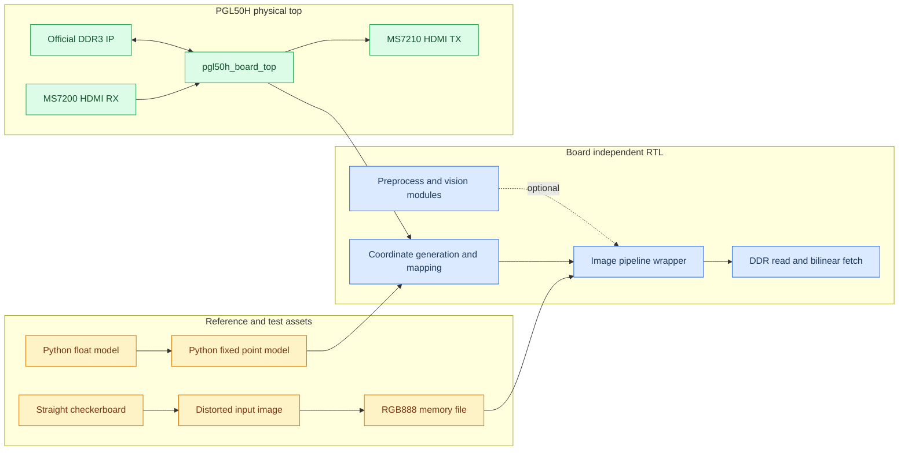
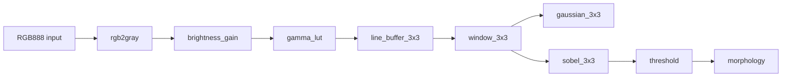
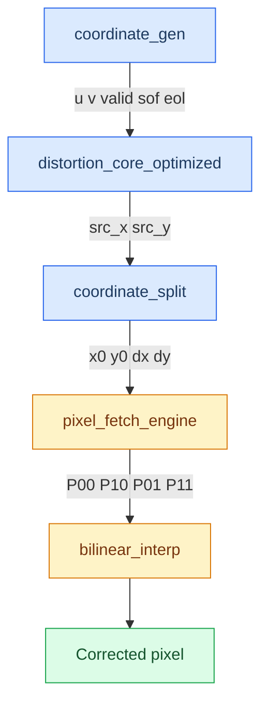
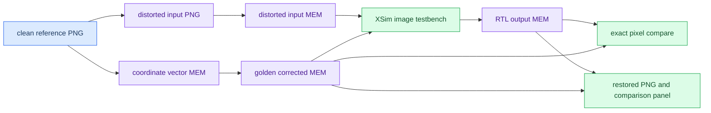
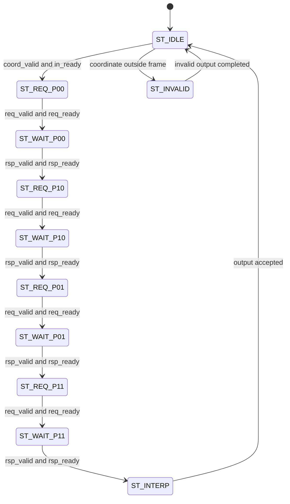

# 视频畸变矫正与轻量视觉处理系统：从算法 RTL 到 PGL50H 板载测试

_面向项目汇报和技术讲解的工程流程总结。本文说明模块为什么存在、仿真如何逐级推进，以及最终如何接入 MES50HP/PGL50H 板级系统。_

---

## 📋 一句话说明项目

本项目面向紫光同创盘古 50K 系列 MES50HP/PGL50H 平台，完成一条从视频输入、畸变坐标计算、DDR 图像取样、双线性插值到 HDMI 输出的 FPGA 图像处理链，同时保留灰度化、亮度增益、Gamma、滤波、边缘检测、阈值和形态学等轻量视觉处理模块。

项目的核心不是简单地“把一张图片经过几个模块”，而是完成以下闭环：

1. 用 Python 建立浮点模型和定点逐位模型
2. 用 RTL 实现坐标计算与像素处理
3. 用人造图像代替暂时不存在的相机输入
4. 用 DDR 行为模型代替真实 DDR3
5. 用 HDMI/DDR3 厂商模型或仿真桩代替真实板卡外设
6. 通过 PDS 将同一套 RTL 接入真实 PGL50H 器件工程
7. 最后才进行真实 HDMI、DDR3、显示器和相机联调

## 🗺️ 系统总览

下面这张图是整个项目最适合对外讲解的主线。左侧是没有板卡时的 Python 和 XSim 验证，右侧是有官方资料后搭建的 PGL50H 板级系统。



## 🎯 先理解“畸变矫正”到底在算什么

畸变矫正采用的是**反向映射**，也叫 inverse mapping。

输出图像中的每个目标像素 `(u, v)` 都代表“我想在矫正后的图像上生成这个位置”。RTL 不直接把输入像素向前推，而是根据 `(u, v)` 计算它应该去畸变输入图像的哪个位置取样：

```text
矫正输出坐标 (u, v)
        │
        ▼
计算畸变输入中的源坐标 (src_x, src_y)
        │
        ▼
取源坐标周围四个像素
        │
        ▼
双线性插值
        │
        ▼
矫正后的输出像素
```

因此，测试图片的正确关系是：

```text
原始直线棋盘图
        │ Python 反向映射
        ▼
模拟相机拍到的畸变输入图
        │ RTL 根据输出坐标反向查找
        ▼
接近直线的矫正输出图
```

这也是为什么不能只拿一张直线棋盘图直接送入矫正 RTL 后期待“看出变化”：直线棋盘图本身不是相机的畸变输入，必须先生成具有桶形或枕形变形的输入图。

## 🧱 第一阶段：先完成独立的轻量视觉 RTL

这部分是项目的通用视觉处理基础，目标是先把常见的像素级和 3×3 窗口级模块独立验证清楚。每个模块都要明确像素位宽、定点格式、流水延迟以及 `valid/sof/eol` 控制信号的对齐关系。

| 模块 | 作用 | 关键点 |
|---|---|---|
| `preprocess/rgb2gray.sv` | RGB888 转 8 bit 灰度 | `Gray=(77R+150G+29B)>>8`，1 级寄存器 |
| `preprocess/brightness_gain.sv` | 亮度和增益调整 | `Yout=alpha×Yin+beta`，结果饱和到 0～255 |
| `preprocess/gamma_lut.sv` | Gamma 查找表 | 双 bank LUT，支持配置和旁路 |
| `preprocess/line_buffer_3x3.sv` | 保存相邻两行 | 为 3×3 窗口提供三行同列数据 |
| `preprocess/window_3x3.sv` | 生成 3×3 窗口 | 处理图像边界、行尾和帧切换 |
| `preprocess/gaussian_3x3.sv` | 3×3 高斯滤波 | 使用 `[1 2 1; 2 4 2; 1 2 1]/16` |
| `detect/sobel_3x3.sv` | Sobel 边缘检测 | 计算 `|Gx|+|Gy|` |
| `detect/threshold.sv` | 梯度阈值化 | 帧首锁存阈值，输出二值像素 |
| `detect/morphology.sv` | 腐蚀或膨胀 | 3×3 全 AND 或全 OR 逻辑 |

这些模块可以组成如下视觉预处理链：



这条链和主畸变矫正链在工程上是两条可以独立验收的路线。当前板级矫正演示优先打通了“畸变坐标 + DDR 取样 + 双线性插值 + HDMI 输出”，轻量视觉模块可以在输入端或矫正输出端按功能需求插入。

每个基础模块的仿真重点包括：

- 固定输入和边界输入是否逐像素正确
- 最大值、最小值、负数和饱和行为是否正确
- `in_valid` 出现空拍时，输出不会错误地产生有效像素
- `sof` 和 `eol` 是否与对应像素保持同拍
- 一帧结束到下一帧开始时，行缓存和窗口状态是否清空或正确补零
- 仿真结果与 `software/models/` 中的 Python 模型是否一致

对应的 Testbench 位于 `sim/tb_rgb2gray.sv`、`sim/tb_brightness_gain.sv`、`sim/tb_gamma_lut.sv`、`sim/tb_line_buffer_3x3.sv`、`sim/tb_window_3x3.sv`、`sim/tb_gaussian_3x3.sv`、`sim/tb_sobel_3x3.sv`、`sim/tb_threshold.sv` 和 `sim/tb_morphology.sv`。

## 🧮 第二阶段：建立浮点模型和逐位定点模型

### 浮点模型：先确认算法方向

`software/distortion_float.py` 用浮点数描述 Brown-Conrady 畸变模型，主要计算过程为：

```text
x = (u - cx) / fx
y = (v - cy) / fy
r2 = x*x + y*y
radial = 1 + k1*r2 + k2*r2*r2

xd = x*radial + 2*p1*x*y + p2*(r2 + 2*x*x)
yd = y*radial + p1*(r2 + 2*y*y) + 2*p2*x*y

src_x = fx*xd + cx
src_y = fy*yd + cy
```

浮点模型的作用是确认公式、畸变方向和边界行为，适合画图和观察结果，不适合直接作为 RTL 的逐位判断标准。

### 定点模型：再冻结 RTL 数值规则

`software/bitaccurate_distortion.py` 把同一套公式改成整数和定点计算，明确每个中间量的位宽、移位和饱和位置。它产生的坐标向量包含：

- `x0/y0`：源图像左上邻居像素坐标
- `dx/dy`：Q16 双线性插值小数部分
- `coord_valid`：源坐标是否位于可取样边界内
- `src_x/src_y`：便于调试的 Q19 源坐标

当前优化核心的主要内部格式是：

| 数据 | 格式或位宽 | 用途 |
|---|---|---|
| 中心化坐标 | 扩展有符号整数 | `u-cx`、`v-cy` |
| 归一化坐标 | S20.Q18 | `x`、`y`、`x²`、`y²`、`xy`、`r²` |
| 畸变系数 | 与模型对应的定点格式 | `k1/k2/p1/p2` |
| 畸变坐标 | S21.Q18 | `xd`、`yd` |
| 焦距和主点 | S24.Q12 内部形式 | 源坐标恢复 |
| 输出源坐标 | signed Q19 | 送入 `coordinate_split` |
| 插值比例 | Q16 | 送入双线性插值器 |

此阶段的核心原则是：**Python 模型和 RTL 不仅结果接近，而且在相同的截断、移位和饱和位置上逐位一致。**

## 🔢 第三阶段：从坐标模块发展到畸变坐标核心

畸变坐标 RTL 的功能可以分成五层：

| 层次 | RTL 文件 | 工作内容 |
|---|---|---|
| 目标坐标 | `distortion/coordinate_gen.sv` | 按光栅顺序产生输出图像的 `(u,v)` |
| 参考核心 | `distortion/distortion_core.sv` | 结构清楚的基准实现 |
| 优化核心 | `distortion/distortion_core_optimized.sv` | 面向 PDS 时序的分级流水实现 |
| 坐标拆分 | `distortion/coordinate_split.sv` | Q19 源坐标拆成整数坐标和 Q16 小数 |
| 图像封装 | `distortion/distortion_image_pipeline.sv` | 把坐标、取样和插值连成可仿真的整链 |

优化核心目前采用 13 拍可见延迟，但吞吐率仍然是每拍一个坐标。`valid/sof/eol` 和坐标数据一起经过流水线，不能只延迟像素而不延迟控制信号。



### 为什么要保留 `distortion_core.sv`

`distortion_core.sv` 是参考版本，重点是公式直观和便于对照；`distortion_core_optimized.sv` 是面向 PGL50H 实现的优化版本，重点是把长乘加路径切成多个寄存器级。

两者不是同时必须放在最终硬件数据通路中的两个核心，而是：

- 参考核心用于结构对照和功能回归
- 优化核心用于实际 PDS 工程和板级系统
- 两者应由相同的 Python 向量进行比较

## 🖼️ 第四阶段：从算法坐标到图片级验证

这一阶段要解决的核心问题是：**单个坐标或单个像素通过，不等于整幅图像通过。**
因此需要把 Python 算法、图像文件、RTL 输入输出和可视化结果串成一条可重复的验证链。

### 4.1 先区分三种“图像”

没有相机和板卡时，不能直接采集真实视频，但可以用数学模型构造一套有标准答案的数据：

| 名称 | 含义 | 在验证中扮演的角色 |
|---|---|---|
| 直线参考图 | Python 生成的无畸变棋盘图 | 已知的正确答案，检查矫正后是否恢复直线 |
| 模拟相机输入图 | 对直线参考图施加 Brown-Conrady 畸变后的图 | 模拟真实镜头送入 FPGA 的输入 |
| 黄金输出帧 | Python 使用与 RTL 相同定点规则计算的结果 | 与 RTL 输出逐像素比较的标准 |

注意：**不能把直线参考图直接送进“畸变矫正”模块来证明算法正确。**如果输入本身没有畸变，输出看起来仍可能正常，但这没有验证模块是否真的把弯曲像素取回了正确位置。

### 4.2 为什么要做“反向映射”

畸变矫正的输出图像每个位置 `(u,v)` 都需要找到它应该从输入图像的哪个位置取样。这个过程是：

```text
输出像素 (u,v)
       │
       ▼
畸变模型计算输入坐标 (x,y)
       │
       ▼
读取输入图像四邻居并双线性插值
       │
       ▼
得到矫正后的输出像素
```

因此软件端也要按照这个方向生成模拟相机图：对每个“相机输入像素”反求它来自直线参考图的哪个位置，再做插值。脚本 `generate_distorted_input.py` 通过迭代求解 Brown-Conrady 逆关系，再用软件双线性插值生成 `distorted_input_256x192.png`。这样，RTL 使用正向的“输出坐标找输入坐标”过程时，才有机会把它还原回来。

### 4.3 每个仿真脚本为什么存在

这些文件不是重复造轮子，而是把不同格式、不同验证职责连接起来：

| 文件 | 怎么实现 | 为什么需要 |
|---|---|---|
| `create_checkerboard.py` | 按像素坐标和方格尺寸交替生成黑白/彩色棋盘 | 直线和边界非常明显，最容易观察几何畸变 |
| `generate_distorted_input.py` | 使用相机内参和畸变系数反向求坐标，再软件插值 | 在没有相机时构造“相机拍到的输入” |
| `image_to_mem.py` | 按光栅顺序把每个 RGB888 像素写成一行 `RRGGBB` | `$readmemh` 只能直接初始化存储器，不能直接读取 PNG |
| `generate_distortion_vectors.py` | 按 RTL 定点位宽生成 `x0/y0/dx/dy/coord_valid` 和黄金帧 | 固定点量化、边界处理必须与 RTL 一致，不能只比较浮点结果 |
| `mem_to_png.py` | 每行解析一个 RGB888 word，再按宽高恢复 PNG | 把波形/存储器结果还原成可以肉眼检查的图像 |
| `compare_mem_frames.py` | 检查像素数量、逐 word 比较并报告坐标 | 自动判断“完全相同”而不是依赖肉眼看图 |
| `create_correction_panel.py` | 拼接参考图、输入图、RTL 图和放大差分图 | 给汇报或调试提供一张完整证据图 |

典型的数据流如下：



所有图片、MEM、差分图和本次运行记录统一放到 `result/sim_assets/<simulation_name>/`，例如 `result/sim_assets/mes50hp_top_image_256x192/`。这样可以按仿真批次追溯输入、输出和脚本参数，而不会把临时文件散落在工程根目录。

### 4.4 图片级 Testbench 如何工作

图片级 Testbench 按光栅顺序遍历整幅图，每个输出像素都经历同一条 RTL 数据路径：

1. Testbench 提供目标输出坐标 `(u,v)` 和帧控制信号。
2. 坐标核心计算输入源坐标，产生 `x0/y0/dx/dy/coord_valid`。
3. `pixel_fetch_engine` 将源坐标拆成四个邻居地址。
4. DDR 行为模型按地址返回四个 RGB888 像素。
5. `bilinear_interp` 计算一个输出像素。
6. Testbench 检查 `out_valid`、SOF/EOL 和像素顺序，并把输出写入 `.mem`。
7. `compare_mem_frames.py` 将 RTL `.mem` 与 Python 黄金 `.mem` 逐像素比较。
8. `mem_to_png.py` 和 `create_correction_panel.py` 把结果还原为图像。

因此，图片级通过同时证明了坐标公式、定点量化、地址映射、四邻居顺序、握手停顿和双线性插值都没有破坏整帧数据。

## 💾 第五阶段：Pixel Fetch、DDR 协议与双线性插值

这一阶段要解决的是：**坐标核心只知道“去哪里取”，但 FPGA 还必须把这个坐标变成真实的存储器请求，并正确等待返回数据。**

### 5.1 `pixel_fetch_engine.sv` 的输入和输出

坐标核心输出的是一个“取样事务”：

```text
x0, y0       源图像整数坐标
dx, dy       源坐标小数部分，定点格式
coord_valid  当前事务有效
```

Pixel Fetch 引擎将一个事务展开成四个邻居像素：

```text
P00 = (x0,     y0)
P10 = (x0 + 1, y0)
P01 = (x0,     y0 + 1)
P11 = (x0 + 1, y0 + 1)
```

对于一帧按行存储的 RGB888 图像，逻辑像素地址是：

```text
addr = y * FRAME_STRIDE_PIXELS + x
```

因此四个请求地址分别为 `base`、`base+1`、`base+stride` 和 `base+stride+1`。这里的 `FRAME_STRIDE_PIXELS` 必须和实际帧缓存布局一致；如果把字节地址、像素地址和 DDR word 地址混用，画面通常会出现斜线、错行或整块错位。

### 5.2 为什么需要状态机和握手

真实 DDR3 不是“给地址马上返回数据”的组合逻辑。请求可能等待，响应也可能暂时不能接收，所以引擎必须保存事务上下文。当前 `pixel_fetch_engine.sv` 使用 `ST_IDLE`、四组请求/等待状态、`ST_INTERP` 和 `ST_INVALID` 等状态：



握手的含义可以这样讲：只有 `valid && ready` 同时为 1，事务才真正发生。发送方在 `valid=1` 且接收方 `ready=0` 时必须保持地址和控制信号稳定；接收方在 `valid=1` 且自己 `ready=0` 时必须保持响应数据稳定。Testbench 和 DDR 行为模型专门制造等待和停顿，就是为了检查 RTL 是否遵守这个协议。

### 5.3 为什么 `distortion_image_pipeline.sv` 需要缓存

当前 Pixel Fetch 一次只处理一个坐标事务，忙于等待四个返回数据时不能接收下一组坐标。因此 `distortion_image_pipeline.sv` 不能让坐标核心无限制地连续输出，而是用 `in_ready`、`coordinate_in_flight` 和坐标缓存控制流量：

```text
坐标核心 ──> 一项坐标缓存 ──> pixel_fetch_engine ──> 结果保持槽 ──> 输出
```

这不是为了改变算法，而是为了做速率匹配。没有这个缓存时，坐标核心和存储器链路速度不一致，就会发生坐标覆盖、漏像素或输出错位。

### 5.4 `bilinear_interp.sv` 为什么分成两级

双线性插值先在上下两行分别做水平插值，再沿垂直方向插值：

```text
top    = P00 + dx × (P10 - P00)
bottom = P01 + dx × (P11 - P01)
out    = top + dy × (bottom - top)
```

RGB 三个通道并行执行。乘法中间结果保留足够位宽，最后按照定点小数位统一移位、舍入或截断，再限制到 8 bit。分成两级的原因是减少单周期组合逻辑深度，方便 100 MHz 时序收敛；代价是需要在流水寄存器中同步保存 `valid`、坐标和帧边界信息。

## 🧪 第六阶段：XSim 文件体系和逐级验证方法

这一阶段要解决的是：**如何把“代码可能正确”变成可重复、可定位、可汇报的证据。**

### 6.1 仿真文件各自是什么

| 文件类别 | 典型文件 | 原理和实现 | 为什么不能省略 |
|---|---|---|---|
| 被测 RTL | `rtl/**/*.sv` | 可综合硬件描述，使用时钟、握手、状态机和定点运算处理数据 | 这是最终要进入 FPGA 的真实逻辑 |
| 单元 Testbench | `sim/tb_*.sv` | 产生时钟/复位/输入，实例化 DUT，用断言或比较器检查结果 | 快速定位某个模块的数值或时序问题 |
| 行为模型 | `sim/models/ddr_behavior_model.sv` | 用数组模拟存储器，用延迟和握手模拟 DDR 读响应 | 不需要真实 DDR 芯片就能验证请求/响应协议 |
| 图片级 Testbench | `tb_*_image.sv` | 用 `$readmemh` 读入 MEM，连续驱动一整帧，写出 RTL MEM | 把模块正确性提升到图像正确性 |
| MEM 数据 | `*.mem` | 一行一个 RGB888 或定点数据 word | 是 Python 和 SystemVerilog 之间最简单、可追溯的桥梁 |
| PowerShell Runner | `run_*.ps1` | 固定目录、编译列表、仿真顶层、日志和 PASS 检查 | 保证别人可以用一条命令复现实验 |
| Python 工具 | `software/sim_assets/*.py`、`result/tool/*.py` | 生成输入、黄金答案、格式转换和比较报告 | 提供参考模型和可视化证据 |

其中，`tb_*.sv` 不是要烧进 FPGA 的硬件。它只在仿真时存在，负责“喂数据、接结果、判对错”；真正进入综合的是被测 RTL 和工程中选定的 IP/顶层。

### 6.2 DDR 行为模型到底做了什么

`sim/models/ddr_behavior_model.sv` 内部用数组保存像素，并在启动时执行：

```systemverilog
$readmemh(INIT_FILE, memory);
```

它不会读取 PNG，而是读取已经转换好的 `distorted_input_256x192.mem`。当 RTL 发出 `req_valid && req_ready` 时，模型保存请求地址；经过 `READ_LATENCY` 个时钟后，按地址取出像素并拉高 `rsp_valid`；如果 RTL 暂时没有 `rsp_ready`，模型保持响应数据不变。

这样做模拟了 DDR 的三个关键特征：非零访问延迟、请求/响应握手和返回端反压。它不模拟 DDR3 的电气校准、读写 DQS、刷新和 PHY 训练，所以它能证明“算法和协议逻辑”，不能替代上板验证。

### 6.3 `tb_mes50hp_top_image.sv` 如何真正送入图片

这里容易误解：Testbench 通常不是把 PNG 或像素数组直接接到 `mes50hp_top` 的算法输入端。实际链路是：

```text
tb_mes50hp_top_image.sv
        │ 启动帧、时钟、复位和输出检查
        ▼
mes50hp_top.sv  ──发出像素地址请求──>  ddr_behavior_model.sv
                                          │
                              $readmemh 初始化输入帧
                                          │
                         按地址和延迟返回 RGB888
                                          ▼
mes50hp_top.sv  ──输出矫正像素──> Testbench 写 rtl_corrected.mem
```

也就是说，图片首先被放进“仿真的 DDR”，RTL 仍然按照真实系统的方式主动发起读请求。这样验证结果比直接把像素连到算法输入端更接近将来板上的数据路径。

### 6.4 为什么要逐层跑 XSim

推荐按风险从小到大推进：

| 层级 | 主要文件 | 主要问题 |
|---|---|---|
| 基础模块 | `sim/tb_*.sv` | 单个模块的数值、复位和边界是否正确 |
| 坐标核心 | `tb_distortion_core.sv`、`tb_distortion_core_optimized.sv` | 浮点参考、定点量化和优化结构是否一致 |
| 连续流 | `tb_distortion_core_optimized_stream.sv` | 连续像素、空拍、SOF/EOL、跨帧配置是否正确 |
| 取样链 | `tb_pixel_fetch_bilinear.sv` | 四个地址、返回顺序和插值是否正确 |
| 图片级整链 | `tb_distortion_image_pipeline.sv`、`tb_pixel_fetch_distortion_image.sv` | 坐标到图像是否逐像素一致 |
| 算法顶层 | `tb_mes50hp_top_image.sv` | DDR 行为模型下的 256×192 彩色帧是否完全匹配 |
| 板级结构 | `tb_pgl50h_board_top_compile.sv` | 顶层、官方 IP 和 stub 能否展开，端口是否连接正确 |

各级 Runner 通常执行：

1. 调用 Python 生成或准备 `.png`、`.mem` 和黄金输出。
2. 调用 `xvlog` 编译 RTL、Testbench 和行为模型。
3. 调用 `xelab` 展开指定的仿真顶层，检查层次和端口是否完整。
4. 调用 `xsim -runall` 运行时钟、事务和检查器。
5. 查找 `TEST_PASS`，再用 Python 做逐像素比较和 PNG 可视化。

例如：

```powershell
.\sim\run_distortion_core_optimized.ps1
.\sim\run_distortion_correction_image.ps1
.\sim\run_pixel_fetch_distortion_image.ps1
.\sim\run_mes50hp_top_image.ps1
.\sim\run_pgl50h_board_top_compile.ps1
```

仿真工作目录固定在 `xsim.dir/<simulation_name>/`，图片和可视化结果固定在 `result/sim_assets/<simulation_name>/`。最新算法顶层图片仿真通过时，典型结果包括：

```text
result/sim_assets/mes50hp_top_image_256x192/
├── clean_reference_256x192.png
├── distorted_input_256x192.png
├── rtl_corrected_q18_256x192.png
├── golden_corrected_q18_256x192.png
└── mes50hp_top_correction_comparison.png
```

判断通过要以日志和逐像素比较为准：`TEST_PASS` 说明 Testbench 的控制和协议检查通过，`PASS: RGB888 frames match (256x192)` 说明 RTL 输出与黄金帧逐字节一致；黑色的 `RTL vs GOLDEN DIFF x8` 表示放大后的差分仍为零。

## 🧩 第七阶段：从板无关算法到 MES50HP/PGL50H 顶层

这一阶段要解决的是：**算法在仿真中正确，怎样接入真实板上的 HDMI、DDR3、时钟和显示链路。**

### 7.1 算法顶层和物理顶层不是一回事

当前物理顶层是 `rtl/board/mes50hp/pgl50h_board_top.sv`，内部算法顶层是 `rtl/board/mes50hp/mes50hp_top.sv`。两者职责不同：

| 顶层 | 负责什么 | 是否直接连接板卡管脚 |
|---|---|---|
| `mes50hp_top` | 坐标产生、Pixel Fetch、双线性插值和算法帧处理 | 否，尽量保持板卡无关 |
| `pgl50h_board_top` | 时钟复位、HDMI、DDR3、帧缓存、状态指示和算法接线 | 是，PDS 的物理 top |

板级顶层需要补齐真实系统的边界：系统时钟和复位、MS7200 HDMI 接收、官方 DDR3 控制器/PHY、输入帧写入、算法读回、矫正帧写回、输出帧读取、`sync_vg` 时序和 MS7210 HDMI 发送。

### 7.2 一帧数据怎样走过板级系统

当前 Bring-up 方案采用“先捕获一帧，再矫正并显示”的帧缓存策略：

```mermaid
flowchart LR
    accTitle: PGL50H Board Frame Path
    accDescr: HDMI input is captured into DDR3, the algorithm reads the input frame through an adapter, corrected pixels are written back, and the output frame is sent through HDMI.

    ms7200[MS7200 HDMI RX]
    capture_control[board_video_control]
    input_writer[algorithm_frame_writer]
    ddr3[DDR3 controller and PHY]
    read_adapter[ddr3_pixel_read_adapter]
    algorithm[mes50hp_top]
    output_writer[corrected frame writer]
    frame_reader[ddr3_frame_reader]
    sync_timing[sync_vg]
    ms7210[MS7210 HDMI TX]

    ms7200 --> capture_control
    capture_control --> input_writer
    input_writer --> ddr3
    ddr3 --> read_adapter
    read_adapter --> algorithm
    algorithm --> output_writer
    output_writer --> ddr3
    ddr3 --> frame_reader
    frame_reader --> sync_timing
    sync_timing --> ms7210

    classDef external fill:#fef3c7,stroke:#d97706,color:#78350f
    classDef control fill:#dbeafe,stroke:#2563eb,color:#1e3a5f
    classDef memory fill:#ede9fe,stroke:#7c3aed,color:#4c1d95
    class ms7200,ms7210 external
    class capture_control,input_writer,read_adapter,algorithm,output_writer,frame_reader,sync_timing control
    class ddr3 memory
```



对应到 RTL 的讲解顺序是：

1. MS7200 初始化完成，产生输入视频流和帧边界。
2. `board_video_control` 识别帧首并控制捕获。
3. `algorithm_frame_writer` 把输入帧写入 DDR3 输入区。
4. `mes50hp_top` 按输出坐标请求输入帧中的四邻居像素。
5. `ddr3_pixel_read_adapter` 把算法像素地址翻译成 DDR3 读请求。
6. 矫正像素被写入 DDR3 输出区。
7. `ddr3_frame_reader` 连续读出输出帧。
8. `sync_vg` 产生 HDMI 输出时序，MS7210 将数据发送到显示器。

使用帧缓存的原因是把输入采集、随机取样算法和输出显示解耦。真实板上如果出现黑屏、错行或延迟异常，可以分别检查 HDMI 输入、DDR 写入、算法读请求、DDR 输出读取和 HDMI 时序，而不是把所有问题混在一个实时通路里。

### 7.3 板级仿真能证明什么，不能证明什么

`tb_mes50hp_top_image.sv` 配合 `ddr_behavior_model.sv`，可以验证算法顶层在“类似 DDR 的延迟和反压”下输出整幅正确图像；它不证明真实 DDR3 PHY 已校准，也不证明 HDMI 芯片已经正确配置。

`tb_pgl50h_board_top_compile.sv` 配合 `pgl50h_board_vendor_stubs.sv`，主要验证板级层次能否展开、端口宽度是否匹配、官方 IP 和算法模块是否连接完整；stub 的 `init_done` 或模拟输出不能当作真实芯片行为。

完整证据应分三层理解：

```text
算法图片仿真       → 证明像素算法、地址和协议逻辑
板级结构仿真       → 证明 top、IP、接口和时钟复位连接
PDS 综合/布局布线   → 证明资源、管脚和时序约束可实现
真实板卡测试       → 证明 DDR3 校准、HDMI 芯片和实物视频链路
```

## 🧰 第八阶段：官方资料、PDS 工程和板级仿真资源

这一阶段要解决的是：**哪些代码是真实硬件资源，哪些只是仿真替身，怎样避免把“仿真通过”误解成“板上一定通过”。**

### 8.1 官方资料如何映射到工程

板级实现不是猜管脚，而是从官方例程中提取端口、IP、时钟和约束，再按当前顶层重新组织：

| 官方参考或工程文件 | 提供什么 | 当前工程中的用途 |
|---|---|---|
| `board_reference/mes50hp/06_hdmi_loop` | HDMI RX/TX 端口、MS7200/MS7210 初始化、视频时钟和示例约束 | 确认 HDMI 数据方向、I2C 控制和时序来源 |
| `board_reference/mes50hp/07_ddr3_test` | DDR3 控制器、PHY、读写接口和 DDR 约束 | 确认 DDR3 IP 配置、用户侧接口和初始化状态 |
| `board_reference/mes50hp/10_HDMI_DDR3_OV5640_test` | HDMI、DDR3 和外设整合结构 | 参考整合方式；其中 OV5640 端口不能直接当成 HDMI 输入 |
| `ip/pango/DDR3_50H` | PGL50H 官方 DDR3 IP | PDS 综合和实现时使用的真实 IP |
| `ip/pango/mes50hp_video_pll` | 板级视频 PLL IP | 生成算法/视频所需时钟 |
| `rtl/vendor/mes50hp/hdmi` | `ms72xx_ctl`、MS7200/MS7210 和 I2C 初始化 RTL | 板级 HDMI 芯片配置 |
| `constraints/mes50hp/pgl50h_board_top.fdc` | 管脚、电平、时钟和 DDR 相关约束 | PDS 的物理实现依据 |

### 8.2 三类文件要严格区分

| 类别 | 典型内容 | 是否等于真实硬件 |
|---|---|---|
| 官方 RTL/IP | DDR3 IP、PLL、HDMI 初始化和控制模块 | 是工程要实现或调用的硬件资源，但仍需正确配置和约束 |
| 行为模型 | `ddr_behavior_model.sv` 等数组/延迟模型 | 否，只模拟接口协议和数据返回 |
| Vendor stub | `pgl50h_board_vendor_stubs.sv` 等空壳模块 | 否，只为让仿真层次展开、避免缺少原语或 IP |

最容易讲错的一句话是“板级仿真已经证明 DDR3 正常”。更准确的说法是：**算法图片仿真证明了 RTL 在抽象存储器接口下正确；板级结构仿真证明了模块连接和工程层次完整；只有 PDS 实现和真实板卡运行才能继续证明物理 DDR3、HDMI 和时序。**

### 8.3 从官方例程到当前工程的实施顺序

1. 从 HDMI 例程核对输入/输出端口、I2C 初始化和视频时钟。
2. 从 DDR3 例程核对 IP 生成文件、用户侧读写协议和初始化完成信号。
3. 将官方资源分别放到 `rtl/vendor/`、`ip/pango/` 和 `board_reference/`，不要把算法 RTL 直接改成依赖某个例程的内部信号。
4. 以 `pgl50h_board_top.sv` 作为 PDS 唯一物理顶层，把 `mes50hp_top` 作为内部算法模块接入。
5. 先用行为模型跑图片级算法仿真，再用 vendor stub 跑板级层次展开仿真。
6. 最后在 PDS 中加入真实 DDR3/PLL IP、官方 `.fdc` 和时序约束，执行综合、布局布线、时序报告和 bitstream 生成。

### 8.4 给别人讲解时可以直接使用的核心话术

> 我们先用 Python 生成一张无畸变的直线棋盘图，再根据镜头模型反向生成模拟相机输入；随后把 PNG 转成 `$readmemh` 能读取的 RGB888 MEM。XSim 中，Testbench 只负责时钟、帧控制和结果检查，输入图像实际被加载到 DDR 行为模型里，算法 RTL 像真实硬件一样主动发起像素地址请求。DDR 行为模型加入访问延迟和反压，返回四个邻居像素，Pixel Fetch 和双线性插值生成输出。Testbench 将整帧写回 MEM，与 Python 按同样定点规则生成的黄金帧逐像素比较，再还原成 PNG 观察。这样从数学模型、图像文件、存储器协议到板级数据流，每一层都有独立证据；但行为模型和 stub 不能替代真实 DDR3、HDMI 芯片和 PDS 时序验证。

## 🧱 第九阶段：PDS 中的工程层次

PDS 中最终设置的顶层是：

```text
pgl50h_board_top
├── hdmi_init / ms72xx_ctl
├── input_frame_writer / wr_buf
├── algorithm_system / mes50hp_top
│   └── distortion_image_pipeline
│       ├── coordinate_gen
│       ├── distortion_core_optimized
│       ├── pixel_fetch_engine
│       └── bilinear_interp
├── corrected_frame_writer
├── corrected_frame_reader
├── sync_vg
├── DDR3_50H official IP
└── video_pll official IP
```

PDS 的验证顺序是：

1. 确认器件为 PGL50H 对应封装
2. 确认 `pgl50h_board_top.sv` 是物理顶层
3. 添加算法 RTL、板级 RTL、官方 vendor RTL 和 IP
4. 导入官方或合并后的 `.fdc`
5. `Compile`
6. `Synthesize`
7. `Device Map`
8. `Place & Route`
9. `Report Timing`
10. 检查资源、时序、DDR/HDMI 约束警告

需要区分三个结论：

| 结论 | 说明 |
|---|---|
| 功能仿真通过 | 算法和数据路径在行为模型下得到预期结果 |
| PDS 能综合布局 | RTL、IP 和约束可以映射到目标器件 |
| PDS 时序通过 | 在目标约束和工艺角下满足时钟要求 |

前两个成立，并不自动代表第三个成立。

## 🧪 第十阶段：无板卡时能验证什么，不能验证什么

### 可以验证的内容

- Python 浮点模型的畸变方向
- Python 定点模型与 RTL 的逐位一致性
- 坐标边界和 `coord_valid`
- 四邻居像素地址是否正确
- 双线性插值数值是否正确
- RGB888 通道顺序
- `valid/sof/eol` 是否对齐
- DDR 请求/响应协议在行为模型下是否正确
- 256×192 彩色棋盘图的端到端结果
- PGL50H 顶层是否能够被 XSim 展开
- PDS 是否能够完成综合和布局布线

### 没有板卡时不能最终确认的内容

- 真实 MS7200 是否能锁定 HDMI 输入
- 真实 MS7210 是否能稳定输出到显示器
- 真实 DDR3 是否完成校准并可靠读写
- 真实板级电源、复位、I2C 电平和接口时序
- 实际相机的镜头畸变参数是否和默认标定参数一致
- 高温、低压或长时间运行下的稳定性

所以无板卡阶段的合理说法是：**算法和板级结构已经完成仿真验证，真实电气接口和实物时序仍需要上板验收。**

## 📊 当前项目状态

截至当前阶段，项目已经完成的链路是：

- 基础预处理和轻量视觉模块已独立完成仿真与综合
- Python 浮点参考模型已建立
- Python 定点模型已建立
- 棋盘图、畸变输入图和 MEM 资产生成脚本已建立
- `distortion_core` 参考版本已建立
- `distortion_core_optimized` 已完成多级流水和连续流验证
- Pixel Fetch、DDR 行为模型和双线性插值整链已建立
- `mes50hp_top` 图片级仿真已完成
- `pgl50h_board_top` 板级结构仿真已完成
- 官方 HDMI/DDR3 资料、IP、vendor RTL 和 `.fdc` 已整理进工程
- PDS 已能够完成 Compile、Synthesize、Place & Route 和 Report Timing

当前仍需单独关注的事项是 PDS 时序收敛和真实板卡联调；这两项不属于算法公式错误，而属于目标器件实现和真实接口验证问题。

## 🗣️ 给别人讲时可以这样概括

> 我们先把 RGB 灰度、亮度、Gamma、3×3 窗口、高斯、Sobel、阈值和形态学这些基础视觉模块独立实现并验证。随后针对视频畸变矫正，先用 Python 浮点模型确认 Brown-Conrady 公式和畸变方向，再用定点模型冻结 RTL 的位宽、移位和饱和规则。测试时不能把直线棋盘直接当作畸变输入，而是先通过 Python 反向映射生成模拟相机畸变图，再把它转换成 MEM 送入 RTL。RTL 首先根据每个输出坐标计算输入源坐标，然后拆成整数坐标和小数坐标，向 DDR 行为模型请求四个邻居像素，最后用双线性插值得到输出图像。图片级仿真逐像素和 Python 黄金结果比较一致后，再把算法嵌入 MES50HP 的 HDMI+DDR3 顶层：HDMI 输入帧写入 DDR3，算法从 DDR3 取样并矫正，矫正帧再写回 DDR3，最后读出并通过 HDMI 输出。这样即使暂时没有相机和板卡，也能先把算法、协议、存储路径和 PGL50H 工程结构验证完，最后再把真实 HDMI、DDR3、显示器和相机接上做实物验收。>

## 🔗 工程入口文件

| 内容 | 文件 |
|---|---|
| 项目计划 | [`../docs/plans/基于紫光同创盘古50 MES50HP（PGL50H）的视频畸变矫正与轻量视觉处理系统项目计划.md`](../docs/plans/基于紫光同创盘古50 MES50HP（PGL50H）的视频畸变矫正与轻量视觉处理系统项目计划.md) |
| 无板卡推进计划 | [`../docs/plans/无板卡阶段临时推进计划.md`](../docs/plans/无板卡阶段临时推进计划.md) |
| 接口规范 | [`../docs/interface_spec.md`](../docs/interface_spec.md) |
| 定点数值规范 | [`../docs/numeric_spec.md`](../docs/numeric_spec.md) |
| 畸变核心 | [`distortion/distortion_core_optimized.sv`](distortion/distortion_core_optimized.sv) |
| 图像整链 | [`distortion/distortion_image_pipeline.sv`](distortion/distortion_image_pipeline.sv) |
| 像素取样 | [`memory/pixel_fetch_engine.sv`](memory/pixel_fetch_engine.sv) |
| 双线性插值 | [`interpolation/bilinear_interp.sv`](interpolation/bilinear_interp.sv) |
| PGL50H 物理顶层 | [`board/mes50hp/pgl50h_board_top.sv`](board/mes50hp/pgl50h_board_top.sv) |
| 板级 HDMI/DDR3 资料映射 | [`../docs/board/pgl50h_official_reference_map.md`](../docs/board/pgl50h_official_reference_map.md) |
| 板级约束 | [`../constraints/mes50hp/pgl50h_board_top.fdc`](../constraints/mes50hp/pgl50h_board_top.fdc) |

_本文只总结当前工程的实现路线，不替代官方 IP 使用说明、PDS 器件手册或最终实物测试记录。_
